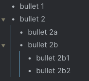
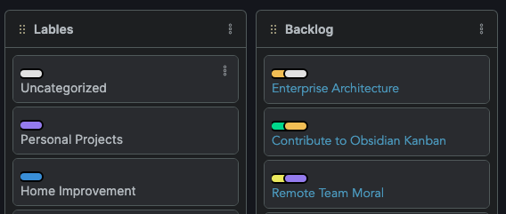
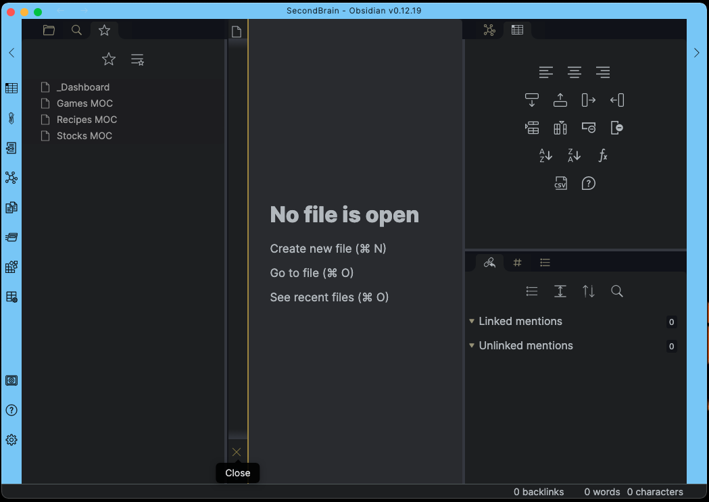

# Obsidian-CSS-Snippets

Just some CSS Snippets for Obsidian.md that address personal concerns or cosmetic preferences.

## Bullet Lines

This helps style the lines that indent bullets. It's a visual queue to know what belongs to what.

## Kanban Bullets

I have gone all in on the [Obsidian Kanban](http://matthewmeye.rs/obsidian-kanban/) plugin. Everything in one place, amazing! This tweak takes inspiration from Trello style and adds labels with colors at the top of the card. This allows me to visually see how cards are categorized.

### Update Kanban Bullets

Starting at the comment `Start Changing Here`, line 63 in `kanban-bullets.css`, you need to do two things;

1. Change the CSS Custom Properties `--color` and `--text-color` to you desired colors.
2. Update all the `[href="#SOMETHING"]` to your tags.

### Categories

Right now there are 11 categories you can have colorized. If you would like more, simply copy and paste the last one and change to match your new category.

### Tags

Up to 7 tags can be added on one card. If you would like more than 7 on one card, you need to duplicate the last `:nth-child` code, increment by 1, and adjust the left property. The exact number can be figured out by experimenting.

## Shorter Links

A visual way to hide a really long link in your document while editing.

## Window Theme

When working with multiple vaults, it would be easy to get mixed up. This update allows you to give a vaults window a color.

## Window Editor Width

Personally, I find the `700px` editor width to confining. This snippet allows for flexible width with min and max constraints.
